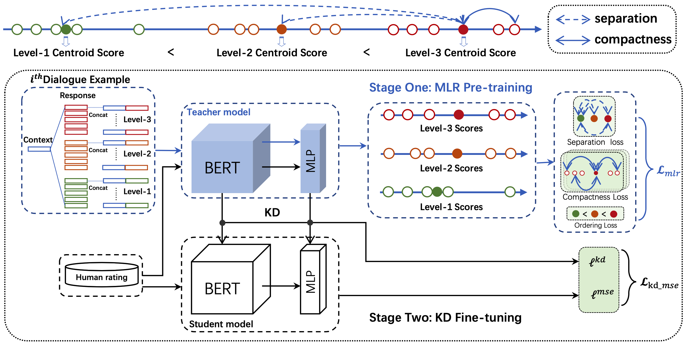

# **QuantiDCE**

This repository contains the source code for the following paper:

[Towards Quantifiable Dialogue Coherence Evaluation](https://arxiv.org/abs/2106.00507)   
Zheng Ye, Liucun Lu, Lishan Huang, Liang Lin and Xiaodan Liang; ACL 2021

## Framework Overview


## Prerequisites
Create virtural environment (recommended):
```
conda create -n QuantiDCE python=3.6
source activate QuantiDCE
```
Install the required packages:
```
pip install -r requirements.txt
```

Install Texar locally:
```
cd texar-pytorch
pip install .
```

Note: Make sure that your environment has installed **cuda 10.1**.

## Data Preparation

QuantiDCE contains two training stages: MLR pre-training and KD fine-tuning.

To prepare the data for MLR pre-training, please run:

```
cd ./script
bash prepare_pretrain_data.sh
```

To prepare the data for KD fine-tuning, please run:

```
cd ./script
bash prepare_finetune_data.sh
```
Note: To reproduce the results in our paper, please directly use the data `./data/human_judgement_for_fine_tuning/dailydialog_EVAL` for KD fine-tuning since we forgot to set a seed when generating the fine-tuning data.


## Training
To train metrics by QuantiDCE, please first run the script for MLR pre-training:

```
cd ./script
bash pretrain.sh
```

And then, run the script for KD fine-tuning:

```
cd ./script
bash finetune.sh
```

Note: The [checkpoint](https://drive.google.com/file/d/1Wx7Gxy5AwnHf2p98O6jhNmnqKH9a8Oe0/view?usp=sharing) of our final QuantiDCE is provided. You can download it and unzip into the root directory of our project.

## Evaluation
To see the performance of QuantiDCE during training, you can refer to the evaluation result file `./output/$SEED/$CHECKPOINT_NAME/human-correlation_results_train.txt`.

To evaluate a certain checkpoint after training, please modify the arguments in `./script/eval.sh` and run:
```
cd ./script
bash eval.sh
```

## Inference
Coming soon.
